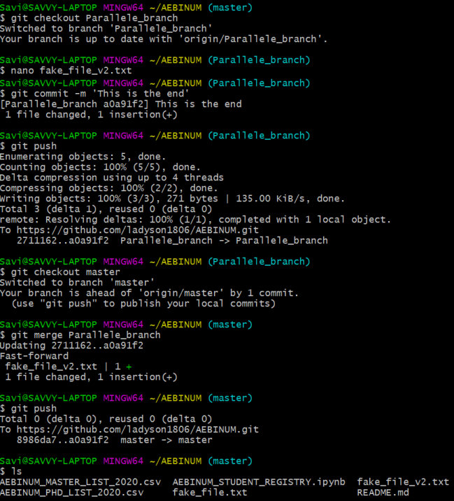

# Data.Trek 2020: Git Tutorial

__Author: Savandara Besse__

_____

## A. ACKNOWLEDGMENTS
-	Thanks to @FrancisBanville, @graciellehigino and
@gabrieldansereau for the Git Demonstration on Zoom! <br>
It helped me a lot to write this summary tutorial 😊

## B. INSTALLATION
Depending of your operating system, follow the instructions to install Git from this website page: https://carpentries.github.io/workshop-template/#git

______

## Main steps

### 1. Create a GitHub account
- Sign up on https://github.com/

### 2.	Configure your username and email on Git
- `--global` will set this username and email for all your Git repositories

##### a. user.name
In your terminal:
1. Set a Git username:

```bash
$ git config --global user.name "Datatrek Team"
```
2. Confirm that you have set the Git username correctly:

```bash
$ git config --global user.name
> Datatrek Team
```

##### b. user.email
Change the current working directory to the local repository where you want to configure the name that is associated with your Git commits.

In your terminal:

1. Set an email address in Git. You can use your GitHub-provided no-reply email address or any email address.

```Bash
$ git config --global user.email "email@example.com"
```

2. Confirm that you have set the email address correctly in Git:

```bash
$ git config --global user.email
> email@example.com
```


### 3.	Create your Git repo and clone it into your local computer
-	Follow the guidelines here to create your repository: https://help.github.com/en/github/getting-started-with-github/create-a-repo

  > - Read until this line: “Congratulations! You've successfully created your first repository and initialized it with a README file.”
  > - The next part is about making a commit from the web interface

-	Clone your repository on your computer
  1.	Open Git Bash
  2.	Write `cd TO/YOUR/PATH/FOLDER`
  3.	Write `git clone http://www.github.com/your_repository_url`
  4.	Enter in the folder using `cd` and check if the content of your report was created with `ls`
        - You should have only an empty README.md file

> __Note__: Your will collect this link on the main page of your repository by clicking on the “Clone/Download button”


### 4. Add a new file into your repository and update your Git repo
1.	Create a file in your folder
  - In my example, it will be an empty txt file : fake_file.txt
2.	Write `git add fake_file.txt` will “warn” your git that you want to commit a change
3.	Write `git commit -m “New file”` will add a short description related to your commit
4.	Write `git push` to update your git repo


> __Notes__:
> -	Always think to commit if you are modifying a file! (That’s make a historic of your changes aka. versioning)
> - Never forget this order: <center>__add / commit / push__</center>
-	`git status` will give you an overview of what you need to commit
  - If you are working with someone, it is important to always have the last recent version of your Git repo
-	 `git pull` will help you to have the last version of the Git repo from Github (not show in my example)
  - If you have something new in your Git repo (either because you add something through the web interface or someone else add something in the Git repo)
  - If nothing changed, it will tell you that your repo is up to date


## 5. Create and work in a branch
-	Creating a branch is useful when you want to make some tests without modifying your master branch aka. _the main one_
-	In this example, I will create a branch called Parallele_branch and I will add a new file in this branch
  - You can directly create a branch and be placed in it by writing `git checkout -b  Parallele_branch`
  - To switch between your different branches, you will the write `git checkout BRANCHNAME (here master or Parallele_branch)`
-	If you are working in team, be sure to create your own branch to not overwrite the code of your team mate!


> <center> Have you seen the differences between branches??</center>

## 6.	Merge the content of a branch
-	If the file you add in your second branch will be need in the final version of your code, you need to merge to the master branch
  -	First you will need to come back to the master branch with this command line `git checkout master`
  -	Then, you will merge the branch Parallele_branch to master with this command line `git merge Parallele_branch`



> __Notes__:
-	To delete a branch, write `git checkout -d BRANCHNAME`
  -	Avoid deleting your master branch, tho’

______

<center> THE END! </center>

______
